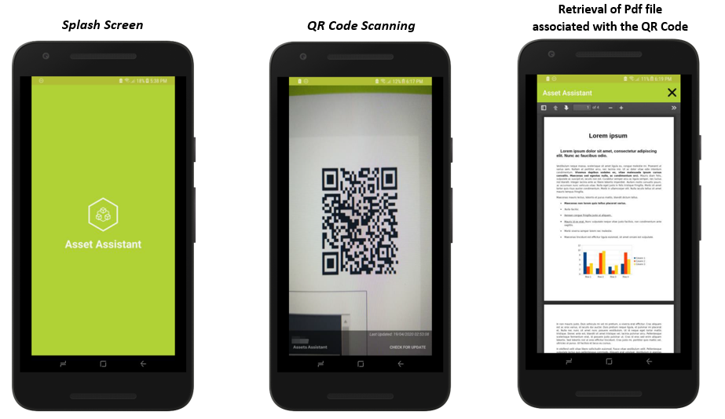

# AssetAssistant

Asset Assistant includes three distinct components, a web app, web API and a mobile app developed as a cross-platform application for IOS and Android. This application is developed for an energy company in New Zealand. The main aim of this application is to assist workers of the company on how to use different machinery (assets) as well as provide information about the assets. The technology stack used in developing this application is Xamarin.Forms for developing the cross-platform mobile app for IOS and Android. HTML, Bootstrap, .Net Core and C# for the web app and .Net Cor, C# and SQL Server for the web API.

The idea for this app comes for a similar concept’s used in the Gym’s, that is when a person is new to the gym, there are multiple machines used to train different body parts. Each machine in the gym has a QR code if you do not know how to use a machine or require more information you scan the QR code via your phone and there you have detailed information about that particular machine. Similarly, The Energy company wanted to develop a system where they would have QR codes on different assets throughout the company and anyone with the Asset Assistant mobile app will be able to scan the QR code and get the information about the asset on their phone. By developing this system, the company would have a single point to manage their asset’s documentation. As well as they can update or publish new documentation rapidly as there is no physical effort required as in they would simply replace the document associated with the QR code with the updated document and that’s it, next time the user of the asset scan’s the QR Code the user would have the lasted copy of the documentation. Below I have provided a brief description of each component of the system.

### Web App for Managing Asset Documentation:
The Web App is a lightweight web application frontend used for CRUD operations of assets documentation. This web app is for administrative use. To associate documentation with an asset, the administrator accesses the web portal, create a new entry for the asset documentation. The asset documentation will be stored in the database and a QR code for that asset documentation will be generated. The administrator can now print the QR code and place it on the asset.

* Below image shows the dashboard view. Here we can see the multiple documents associated with different assets. You can quickly manage each document by hovering over the three-dot icon and additional options will be displayed. Additional you can also click on individual row to navigate to individual asset page.

* For adding a new asset documentation, simply click on the “Add Asset” button on the top right corner of the dashboard view. You will see a dialog box pop-up, fill in the details and click “Add” button.

* Your asset documentation will be saved in the database and you will be navigated to uploaded asset page as shown in the image below.

### Web API
The Web API is used for synchronizing the data changes made by the web portal into the mobile app. On every launch, the mobile app checks for network connectivity and if the connectivity exists, the mobile app will make an API call to this API and retrieve the changes to the remote database and store it in the local database.

### Accessing Asset Documentation via the Asset Assistant Mobile App:

The user download and install the Asset Assistant mobile app from the local app store. When the user launches the Asset Assistant app it fetches all the documents from the web API and stores it in the local database. The reason to download and store all the document locally is to support offline capability. This means that even when there is no network connectivity the user will still be able to access asset documentation by scanning the QR code.

1. After downloading and installing the app from the local App store. Start the application.
2. At initial start-up, it may take a few seconds to download the files from the server. A small spinner will be shown on the bottom right corner alongside last updated timestamp. The app is designed to fetch update at each launch when network connectivity is available.
3. Once the app is successfully updated you can scan a valid QR Code and it will display the associated pdf.

Below show screenshots depicts the app usage:

